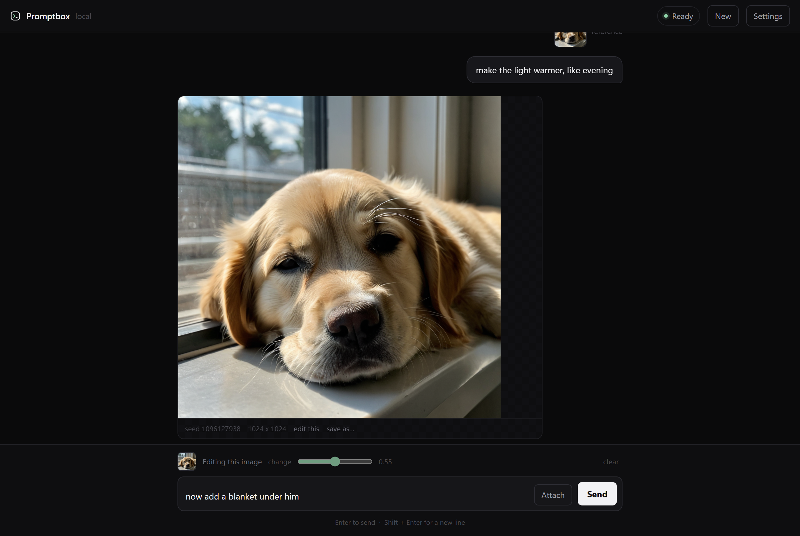

# Promptbox

A plain desktop app for local image generation and editing. Type a prompt, get a
picture. Then say what to change.



Promptbox is a small native window over a [ComfyUI](https://github.com/comfyanonymous/ComfyUI)
install. ComfyUI is powerful and its node graph is a wall - if you just want an image
from a sentence, this is that.

- **Conversational** - each result carries forward, so you can keep refining
- **Native window**, not a browser tab
- **Fully local** - no accounts, no API keys, nothing leaves your machine
- **Starts the backend for you** - point it at your ComfyUI folder once
- **Sane defaults** - the realism prompt-shaping is built in
- **One dependency** - `pywebview`, plus Python's standard library

---

## Why the defaults matter

The most common mistake with SDXL is stuffing the prompt with `8k, masterpiece,
photorealistic, ultra detailed`. Those terms pull the model *toward* glossy CGI -
they are the reason so much local output has plastic skin and dead eyes.

Promptbox does the opposite by default. It appends a short realism suffix and ships a
negative prompt that bans the glossy tells:

```
airbrushed, plastic skin, poreless, cgi, 3d render, doll, waxy, uncanny …
```

So write plainly - *"a golden retriever puppy asleep on a windowsill"* - and let the
defaults do the work. Both are editable under **Advanced** if you disagree.

---

## Editing

Attach an image, or drag one onto the window, or press **edit this** under any result.
Then describe the change and send.

Editing is img2img: the source is encoded, partially re-noised, and re-sampled. The
**change** slider is the whole story.

| Change | What it does |
|---|---|
| 0.25-0.40 | recolour, lighting, small texture shifts |
| 0.45-0.60 | clothing, background, style; the subject mostly survives |
| 0.70+ | effectively a new image, loosely guided by the old one |

Worth being straight about the limitation: this is *not* instruction editing. It will
not isolate "make only the shirt red" and leave everything else untouched, and at
higher strengths faces drift. Models that do true instruction editing (FLUX.2 klein,
FLUX.1 Kontext, Qwen-Image-Edit) work through the same ComfyUI backend, and wiring one
in is on the roadmap below.

---

## Requirements

- Windows 10/11, macOS, or Linux
- Python 3.10+
- An existing [ComfyUI](https://github.com/comfyanonymous/ComfyUI) install with at
  least one checkpoint in `models/checkpoints/`
- A GPU with ~6GB VRAM for SDXL models (CPU works, slowly)

Promptbox deliberately does **not** bundle ComfyUI or ship model weights.

## Install

```bash
git clone https://github.com/YOURNAME/promptbox
cd promptbox
python -m venv .venv
.venv\Scripts\pip install -r requirements.txt
.venv\Scripts\python -m promptbox
```

### Build a standalone .exe (Windows)

```powershell
powershell -ExecutionPolicy Bypass -File build_exe.ps1
```

Produces `dist\Promptbox.exe` (~15 MB) with the icon embedded. Double-click to run;
no console window, no Python needed on the machine. Drag it to your Desktop or pin it.

### Desktop shortcut without building

```powershell
powershell -ExecutionPolicy Bypass -File install_shortcut.ps1
```

Points a Desktop shortcut at `pythonw`, so nothing flashes up on launch. Prefer the
`.exe` if you want a reliable taskbar icon: Windows caches shortcut icons
aggressively, and an embedded icon sidesteps that entirely.

The icon is generated by `assets/make_icon.py` if you want to change it.

### First run

On first run it looks for ComfyUI in the usual places (`~/ComfyUI`, `~/AI/ComfyUI`,
`~/Documents/ComfyUI`, `C:\ComfyUI`, and the Windows portable layout). If it can't
find yours, set the folder under **Advanced → ComfyUI folder**, then press
**Start backend**.

## Use

| | |
|---|---|
| Send | `Enter`. `Shift + Enter` for a new line |
| Edit | attach, drag a file in, or press **edit this** under a result |
| New | clears the thread and starts a fresh image |
| Settings | model, size, steps, CFG, sampler, seed, negative prompt |
| Save | **save as…** under any result |

Images are written to `ComfyUI/output/promptbox/`.

## How it works

```
┌─────────────┐   pywebview JS bridge   ┌──────────────┐   HTTP    ┌─────────┐
│  index.html │ ──────────────────────► │  Api (Python)│ ────────► │ ComfyUI │
└─────────────┘                         └──────────────┘           └─────────┘
```

`comfy.py` builds a fixed graph and posts it to ComfyUI's `/prompt` endpoint, polls
`/history/{id}`, and returns the image as a data URI. Two graphs: text-to-image from an
empty latent, and img2img which uploads the source through `/upload/image` and encodes
it with `VAEEncode`. No node editing, no workflow JSON to manage.

If Promptbox started ComfyUI, it shuts it down on exit. If ComfyUI was already
running, it's left alone.

## Roadmap

- [ ] Batch generation (n images per prompt)
- [ ] Inpainting with a brush mask
- [ ] Instruction editing via FLUX.2 klein / Kontext
- [ ] Character consistency via IPAdapter reference image
- [ ] Prompt history that survives restarts

Issues and PRs welcome.

## License

MIT - see [LICENSE](LICENSE).
